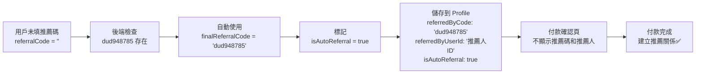
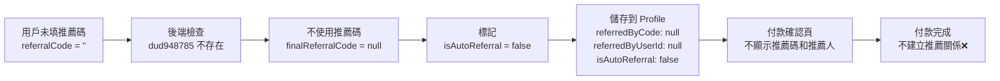
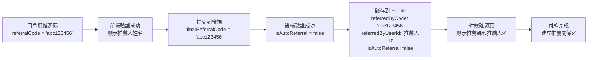
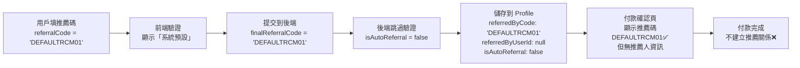

# 註冊流程深度分析 - 推薦碼邏輯完整解析

## 📋 目錄
1. [推薦碼配置總覽](#推薦碼配置總覽)
2. [註冊流程完整步驟](#註冊流程完整步驟)
3. [推薦碼處理邏輯](#推薦碼處理邏輯)
4. [前後端不一致問題](#前後端不一致問題)
5. [資料結構追蹤](#資料結構追蹤)
6. [建議與修正](#建議與修正)

---

## 推薦碼配置總覽

### 🔍 當前系統中的推薦碼

| 推薦碼 | 位置 | 用途 | 狀態 |
|--------|------|------|------|
| **`dud948785`** | 後端 `/supabase/functions/server/auth.ts:313` | **系統預設推薦碼** | ✅ **正在使用** |
| **`DEFAULTRCM01`** | 前端 `/components/CompleteProfile.tsx:409` | 前端驗證繞過（顯示「系統預設」） | ⚠️ **僅前端** |
| **`DEFAULTRCM01`** | 後端多處 | **被排除的推薦碼**（不計入推薦關係） | ⚠️ **特殊處理** |

---

## 註冊流程完整步驟

### 📍 Step 0: Email 驗證（Supabase Auth）

**路由：** `/login` → Email 驗證 → 自動導向 `/auth/complete-profile`

**數據狀態：**
```json
{
  "supabaseUser": {
    "id": "uuid-from-supabase",
    "email": "user@example.com",
    "emailVerified": true
  },
  "kvStore": null,  // KV Store 中尚無用戶資料
  "localStorage": null
}
```

---

### 📍 Step 1: 填寫基本資料（CompleteProfile.tsx）

**路由：** `/auth/complete-profile`

**用戶操作：**
1. 填寫姓名、身分證字號、手機、生日
2. **（選填）填寫推薦碼**
3. 同意服務條款
4. 點擊「下一步」

---

#### 🎯 推薦碼處理流程（前端）

**情況 A：用戶填寫了推薦碼**

```typescript
// CompleteProfile.tsx 第 403-467 行
verifyReferralCode = async () => {
  // 1. 特殊處理：硬編碼的 'DEFAULTRCM01'
  if (formData.referralCode === 'DEFAULTRCM01') {
    setCodeVerified(true);
    setVerifiedReferralCode(formData.referralCode);
    setReferrerName('系統預設');  // ⚠️ 顯示為「系統預設」
    showToast('推薦碼驗證成功', 'success');
    return;
  }
  
  // 2. 正常推薦碼：呼叫 API 驗證
  const result = await apiRequestJson(
    buildApiUrl('/listings/verify-referral-code'),
    {
      method: 'POST',
      body: JSON.stringify({
        referralCode: formData.referralCode.toLowerCase().trim(),
        currentUserId: null
      }),
    }
  );
  
  if (result.valid && result.referrerName) {
    setCodeVerified(true);
    setVerifiedReferralCode(formData.referralCode);
    setReferrerName(result.referrerName);  // 顯示真實推薦人姓名
    showToast('推薦碼驗證成功', 'success');
  }
}
```

**情況 B：用戶未填寫推薦碼**

```typescript
// CompleteProfile.tsx 第 189-192 行
// 在確認警告卡片中顯示
if (formData.referralCode.trim() && referrerName) {
  details.push(`推薦碼：${formData.referralCode}`);
  details.push(`推薦人：${referrerName}`);
} else {
  details.push('您未填寫推薦碼');  // ✅ 明確提示用戶
}
```

**提交到後端：**

```typescript
// CompleteProfile.tsx 第 290-305 行
const response = await fetch(
  `https://${projectId}.supabase.co/functions/v1/make-server-5c6718b9/auth/register`,
  {
    method: 'POST',
    headers: {
      'Content-Type': 'application/json',
      Authorization: `Bearer ${session.access_token}`,
    },
    body: JSON.stringify({
      name: formData.name,
      nationalId: formData.nationalId,
      phone: formData.phone,
      birthDate: formData.birthDate,
      referralCode: formData.referralCode,  // ⚠️ 可能是空字串 ''
    }),
  }
);
```

---

#### 🎯 推薦碼處理流程（後端）

**文件：** `/supabase/functions/server/auth.ts` 第 309-356 行

```typescript
// 4. 智能推薦碼處理（新規格）
let referredByUserId = null;
let referredByListingId = null;
let isAutoReferral = false;
const DEFAULT_REFERRAL_CODE = 'dud948785';  // ✅ 後端預設推薦碼

let finalReferralCode = referralCode;  // 從前端接收的推薦碼

// 1️⃣ 如果用戶沒有填寫推薦碼，嘗試使用預設推薦碼
if (!referralCode || referralCode.trim() === '') {
  console.log(`用戶未填寫推薦碼，檢查預設推薦碼 ${DEFAULT_REFERRAL_CODE} 是否存在...`);
  
  const defaultReferralData = await kv.get(`referral_code:${DEFAULT_REFERRAL_CODE}`);
  
  if (defaultReferralData) {
    console.log(`✅ 預設推薦碼存在，自動使用: ${DEFAULT_REFERRAL_CODE}`);
    finalReferralCode = DEFAULT_REFERRAL_CODE;
    isAutoReferral = true;  // ✅ 標記為系統自動帶入
  } else {
    console.log(`⚠️ 預設推薦碼不存在，不建立推薦關係`);
    finalReferralCode = null;  // ⚠️ 不使用任何推薦碼
  }
} else {
  console.log(`用戶主動填寫了推薦碼: ${referralCode}`);
  isAutoReferral = false;  // ✅ 標記為用戶主動填寫
}

// 2️⃣ 如果有推薦碼（用戶填寫或自動使用預設），進行驗證
if (finalReferralCode && finalReferralCode !== 'DEFAULTRCM01') {
  console.log(`驗證推薦碼: ${finalReferralCode} (${isAutoReferral ? '系統自動' : '用戶主動'})`);
  
  const referralData = await kv.get(`referral_code:${finalReferralCode}`);
  
  if (!referralData) {
    return c.json({ error: "推薦碼無效" }, 400);
  }
  
  referredByUserId = referralData.userId;
  referredByListingId = referralData.listingId;  // 可能為 null
  
  console.log(`✅ 推薦碼驗證成功: ${finalReferralCode}, 推薦人: ${referredByUserId}`);
}
```

---

#### 📊 推薦碼決策邏輯表

| 用戶輸入 | KV Store 中的 `dud948785` | 最終使用的推薦碼 | `isAutoReferral` | 推薦關係 |
|---------|---------------------------|-----------------|------------------|---------|
| **空字串 `''`** | ✅ **存在** | **`dud948785`** | **`true`** | ✅ **建立（自動）** |
| **空字串 `''`** | ❌ **不存在** | **`null`** | **`false`** | ❌ **不建立** |
| **`abc123456`** | ✅ 存在 | **`abc123456`** | **`false`** | ✅ **建立（用戶主動）** |
| **`abc123456`** | ❌ 不存在 | 返回錯誤 | - | ❌ **註冊失敗** |
| **`DEFAULTRCM01`** | - | **`DEFAULTRCM01`** | **`false`** | ⚠️ **跳過驗證** |

**⚠️ 重要說明：**
- `DEFAULTRCM01` 會**跳過後端驗證**（第 339 行：`finalReferralCode !== 'DEFAULTRCM01'`）
- `DEFAULTRCM01` 會被寫入 `user:profile`，但**不會建立推薦關係**
- `DEFAULTRCM01` 在付款流程中也會被排除（`listings.ts:392`, `payment.ts:377`）

---

#### 💾 儲存到 KV Store

**Key:** `user:${userId}:profile`

```json
{
  "id": "uuid-from-supabase",
  "publicUserId": null,
  "email": "user@example.com",
  "name": "張三",
  "nationalId": "A123456789",
  "phone": "0912345678",
  "birthDate": "1990-01-01",
  "isAdmin": false,
  "emailVerified": true,
  "phoneVerified": true,
  "registrationStep": 1,  // ✅ Step 1：基本資訊完成，等待付款
  "referralCode": null,  // ✅ 付款後才會生成
  "referredByCode": "dud948785",  // ⚠️ 可能是：'dud948785'、'abc123456'、'DEFAULTRCM01'、null
  "referredByUserId": "推薦人的userId",  // ⚠️ 可能是：userId、null
  "referredByListingId": "推薦人的listingId",  // ⚠️ 可能是：listingId、null
  "isAutoReferral": true,  // ✅ 標記是否為系統自動帶入
  "createdAt": "2024-12-15T12:34:56.789Z",
  "updatedAt": "2024-12-15T12:34:56.789Z"
}
```

**⚠️ 關鍵欄位說明：**

| 欄位 | 說明 | 示例值 |
|------|------|--------|
| `referredByCode` | 最終使用的推薦碼（可能是用戶填寫或系統自動帶入） | `'dud948785'` \| `'abc123456'` \| `'DEFAULTRCM01'` \| `null` |
| `referredByUserId` | 推薦人的用戶 ID | `'user_xxx'` \| `null` |
| `referredByListingId` | 推薦人的刊登 ID（可能為 null，如果推薦人尚未創建刊登） | `'listing_yyy'` \| `null` |
| `isAutoReferral` | 是否為系統自動帶入的推薦碼 | `true` \| `false` |

---

### 📍 Step 2: 付款確認（PaymentCheckout.tsx）

**路由：** `/payment/checkout`

**顯示資訊：**

```tsx
// PaymentCheckout.tsx 第 580-595 行
<div className="space-y-1 text-sm text-muted-foreground">
  <p>姓名：{pendingUser.name}</p>
  <p>生日：{pendingUser.birthDate}</p>
  <p>身分證字號：{pendingUser.nationalId}</p>
  <p>手機：{pendingUser.phone}</p>
  <p>Email：{pendingUser.email}</p>
  
  {/* ⚠️ 重要：只有「非自動推薦」才顯示推薦碼和推薦人 */}
  {pendingUser.referredByCode && !pendingUser.isAutoReferral && (
    <>
      <p>推薦碼：{pendingUser.referredByCode}</p>
      {referrerInfo && (
        <p>推薦人：{referrerInfo.name}</p>
      )}
    </>
  )}
</div>
```

**邏輯分析：**

| `referredByCode` | `isAutoReferral` | 顯示推薦碼？ | 顯示推薦人？ | 原因 |
|------------------|------------------|-------------|-------------|------|
| `null` | `false` | ❌ | ❌ | 用戶未填寫，系統也未自動帶入 |
| `'dud948785'` | `true` | ❌ | ❌ | 系統自動帶入，不顯示（避免困惑） |
| `'abc123456'` | `false` | ✅ | ✅ | 用戶主動填寫，明確顯示 |
| `'DEFAULTRCM01'` | `false` | ✅ | ✅ | 用戶主動填寫特殊碼，顯示但無實際推薦人 |

---

### 📍 Step 3: 完成付款（processPaymentCallback）

**文件：** `/supabase/functions/server/payment.ts` 第 377 行

**推薦關係建立邏輯：**

```typescript
// 6. 記錄推薦來源
if (referralCode && referralCode !== 'DEFAULTRCM01') {
  console.log(`========== 🔗 開始處理推薦關係 ==========`);
  
  const referralData = await kv.get(`referral_code:${referralCode}`);
  
  if (referralData) {
    // 建立推薦樹、發放獎勵、更新任務...
  }
}
```

**⚠️ 關鍵判斷：`referralCode !== 'DEFAULTRCM01'`**

這意味著：
- ✅ `'dud948785'` → **會建立推薦關係**
- ✅ `'abc123456'` → **會建立推薦關係**
- ❌ `'DEFAULTRCM01'` → **不會建立推薦關係**
- ❌ `null` → **不會建立推薦關係**

---

## 前後端不一致問題

### ⚠️ 問題 1：兩個「預設推薦碼」

| 推薦碼 | 位置 | 用途 |
|--------|------|------|
| **`DEFAULTRCM01`** | 前端 `CompleteProfile.tsx:409` | 前端驗證繞過，顯示「系統預設」 |
| **`dud948785`** | 後端 `auth.ts:313` | 後端真正的預設推薦碼 |

**潛在問題：**
1. 用戶可能會在前端輸入 `DEFAULTRCM01`（因為看到「系統預設」）
2. `DEFAULTRCM01` 會通過前端驗證，但**後端不會建立推薦關係**
3. 用戶以為有推薦人，實際上沒有

---

### ⚠️ 問題 2：`DEFAULTRCM01` 的特殊處理

**被排除的位置：**

1. **註冊時：** `auth.ts:339`
   ```typescript
   if (finalReferralCode && finalReferralCode !== 'DEFAULTRCM01') {
     // 驗證推薦碼...
   }
   ```

2. **創建刊登時：** `listings.ts:392`
   ```typescript
   if (referredByCode && referredByCode !== 'DEFAULTRCM01') {
     // 查詢推薦關係...
   }
   ```

3. **付款回調時：** `payment.ts:377`
   ```typescript
   if (referralCode && referralCode !== 'DEFAULTRCM01') {
     // 建立推薦樹、發放獎勵...
   }
   ```

**結論：** `DEFAULTRCM01` 是一個**無效的推薦碼**，只是為了讓系統不報錯

---

## 資料結構追蹤

### 📋 用戶未填寫推薦碼的完整數據流

#### **情況 A：預設推薦碼 `dud948785` 存在**



**KV Store 數據：**

```json
// user:${userId}:profile
{
  "referredByCode": "dud948785",
  "referredByUserId": "推薦人userId",
  "referredByListingId": "推薦人listingId",
  "isAutoReferral": true
}
```

**前端顯示：**
```
付款確認頁面：
  姓名：張三
  生日：1990-01-01
  身分證字號：A123456789
  手機：0912345678
  Email：user@example.com
  （推薦碼和推薦人不顯示）✅
```

---

#### **情況 B：預設推薦碼 `dud948785` 不存在**



**KV Store 數據：**

```json
// user:${userId}:profile
{
  "referredByCode": null,
  "referredByUserId": null,
  "referredByListingId": null,
  "isAutoReferral": false
}
```

**前端顯示：**
```
付款確認頁面：
  姓名：張三
  生日：1990-01-01
  身分證字號：A123456789
  手機：0912345678
  Email：user@example.com
  （推薦碼和推薦人不顯示）✅
```

---

### 📋 用戶填寫推薦碼的完整數據流

#### **情況 C：用戶填寫有效推薦碼 `abc123456`**



**KV Store 數據：**

```json
// user:${userId}:profile
{
  "referredByCode": "abc123456",
  "referredByUserId": "推薦人userId",
  "referredByListingId": "推薦人listingId",
  "isAutoReferral": false
}
```

**前端顯示：**
```
付款確認頁面：
  姓名：張三
  生日：1990-01-01
  身分證字號：A123456789
  手機：0912345678
  Email：user@example.com
  推薦碼：abc123456  ✅
  推薦人：李四  ✅
```

---

#### **情況 D：用戶填寫 `DEFAULTRCM01`**



**KV Store 數據：**

```json
// user:${userId}:profile
{
  "referredByCode": "DEFAULTRCM01",
  "referredByUserId": null,
  "referredByListingId": null,
  "isAutoReferral": false
}
```

**前端顯示：**
```
付款確認頁面：
  姓名：張三
  生日：1990-01-01
  身分證字號：A123456789
  手機：0912345678
  Email：user@example.com
  推薦碼：DEFAULTRCM01  ⚠️
  推薦人：（無資訊）  ⚠️
```

---

## 建議與修正

### ✅ 建議 1：統一預設推薦碼

**問題：** 前端 `DEFAULTRCM01` 和後端 `dud948785` 不一致

**建議修正：**

#### **選項 A：移除前端的 `DEFAULTRCM01` 邏輯**

**修改文件：** `/components/CompleteProfile.tsx` 第 409-414 行

```typescript
// ❌ 刪除這段代碼
if (formData.referralCode === 'DEFAULTRCM01') {
  setCodeVerified(true);
  setVerifiedReferralCode(formData.referralCode);
  setReferrerName('系統預設');
  showToast('推薦碼驗證成功', 'success');
  return;
}
```

**理由：**
- 前端不應該有硬編碼的特殊推薦碼
- 所有推薦碼驗證應該統一走 API
- 避免用戶混淆

---

#### **選項 B：前端同步使用 `dud948785`**

**修改文件：** `/components/CompleteProfile.tsx` 第 409 行

```typescript
// 修改前
if (formData.referralCode === 'DEFAULTRCM01') {

// 修改後
if (formData.referralCode === 'dud948785') {
```

**理由：**
- 前後端使用同一個預設推薦碼
- 用戶可以主動輸入 `dud948785` 並看到推薦人資訊

---

### ✅ 建議 2：優化付款確認頁顯示邏輯

**問題：** 自動推薦碼不顯示，可能造成用戶疑惑

**建議修正：** 顯示「使用系統預設推薦人」

**修改文件：** `/components/PaymentCheckout.tsx` 第 580-595 行

```typescript
// 修改前
{pendingUser.referredByCode && !pendingUser.isAutoReferral && (
  <>
    <p>推薦碼：{pendingUser.referredByCode}</p>
    {referrerInfo && (
      <p>推薦人：{referrerInfo.name}</p>
    )}
  </>
)}

// 修改後
{pendingUser.referredByCode && (
  <>
    {pendingUser.isAutoReferral ? (
      <p className="text-muted-foreground">推薦人：系統預設推薦人</p>
    ) : (
      <>
        <p>推薦碼：{pendingUser.referredByCode}</p>
        {referrerInfo && (
          <p>推薦人：{referrerInfo.name}</p>
        )}
      </>
    )}
  </>
)}
```

**效果：**

| 情況 | 顯示內容 |
|------|---------|
| 用戶未填推薦碼 + `dud948785` 存在 | `推薦人：系統預設推薦人` ✅ |
| 用戶未填推薦碼 + `dud948785` 不存在 | （不顯示） ✅ |
| 用戶填寫 `abc123456` | `推薦碼：abc123456`<br/>`推薦人：李四` ✅ |

---

### ✅ 建議 3：移除 `DEFAULTRCM01` 的特殊處理

**問題：** `DEFAULTRCM01` 在多處被排除，造成維護困難

**建議修正：** 完全移除 `DEFAULTRCM01` 相關邏輯

**需要修改的文件：**

1. **前端：** `/components/CompleteProfile.tsx:409`
   - 刪除 `DEFAULTRCM01` 驗證邏輯

2. **後端：** `/supabase/functions/server/auth.ts:339`
   ```typescript
   // 修改前
   if (finalReferralCode && finalReferralCode !== 'DEFAULTRCM01') {
   
   // 修改後
   if (finalReferralCode) {
   ```

3. **後端：** `/supabase/functions/server/listings.ts:392`
   ```typescript
   // 修改前
   if (referredByCode && referredByCode !== 'DEFAULTRCM01') {
   
   // 修改後
   if (referredByCode) {
   ```

4. **後端：** `/supabase/functions/server/payment.ts:377`
   ```typescript
   // 修改前
   if (referralCode && referralCode !== 'DEFAULTRCM01') {
   
   // 修改後
   if (referralCode) {
   ```

**理由：**
- 簡化邏輯
- 避免維護困難
- 減少潛在 Bug

---

## 總結

### 📊 當前推薦碼處理邏輯總覽

| 用戶操作 | 前端驗證 | 後端處理 | 最終推薦碼 | `isAutoReferral` | 推薦關係 | 顯示推薦碼 |
|---------|---------|---------|-----------|------------------|---------|-----------|
| **未填寫** + `dud948785` 存在 | 通過 | 自動帶入 | `'dud948785'` | `true` | ✅ 建立 | ❌ 不顯示 |
| **未填寫** + `dud948785` 不存在 | 通過 | 不使用 | `null` | `false` | ❌ 不建立 | ❌ 不顯示 |
| **填寫 `abc123456`** | API 驗證 | 驗證成功 | `'abc123456'` | `false` | ✅ 建立 | ✅ 顯示 |
| **填寫 `DEFAULTRCM01`** | 前端繞過 | 跳過驗證 | `'DEFAULTRCM01'` | `false` | ❌ 不建立 | ✅ 顯示（但無意義） |

### ✅ 核心結論

**Q: 如果用戶沒有填寫推薦碼，預設會代入什麼？**

**A: 答案取決於 KV Store 中是否存在 `dud948785`：**

1. **如果 `referral_code:dud948785` 存在於 KV Store：**
   - ✅ 後端會**自動使用** `dud948785`
   - ✅ 會建立推薦關係（`dud948785` 的持有者成為推薦人）
   - ✅ `isAutoReferral = true`（標記為系統自動帶入）
   - ❌ 付款確認頁**不會顯示**推薦碼和推薦人（避免用戶困惑）

2. **如果 `referral_code:dud948785` 不存在於 KV Store：**
   - ❌ 後端**不會使用**任何推薦碼
   - ❌ **不會建立**推薦關係
   - ✅ `referredByCode = null`、`isAutoReferral = false`
   - ❌ 付款確認頁**不會顯示**推薦碼和推薦人

**關鍵配置：**
```typescript
// 後端 /supabase/functions/server/auth.ts:313
const DEFAULT_REFERRAL_CODE = 'dud948785';
```

**檢查方式：**
```bash
# 在 Supabase Edge Functions 中查詢
await kv.get('referral_code:dud948785');

# 如果返回數據 → 會自動使用
# 如果返回 null → 不會自動使用
```

---

## 🎯 建議實施優先級

| 優先級 | 建議 | 理由 | 影響範圍 |
|--------|------|------|---------|
| **P0（高）** | 移除前端 `DEFAULTRCM01` 邏輯 | 避免用戶輸入無效推薦碼 | 前端 |
| **P1（中）** | 優化付款確認頁顯示 | 提升用戶體驗 | 前端 |
| **P2（低）** | 移除後端 `DEFAULTRCM01` 特殊處理 | 簡化代碼邏輯 | 後端 |

---

## 📝 附錄：相關文件位置

| 功能 | 文件路徑 | 關鍵行數 |
|------|---------|---------|
| 前端註冊表單 | `/components/CompleteProfile.tsx` | 409-467 |
| 前端付款確認 | `/components/PaymentCheckout.tsx` | 580-595 |
| 後端註冊邏輯 | `/supabase/functions/server/auth.ts` | 309-356 |
| 後端創建刊登 | `/supabase/functions/server/listings.ts` | 392 |
| 後端付款回調 | `/supabase/functions/server/payment.ts` | 377 |
| 獎勵歷史顯示 | `/components/reward/RewardHistory.tsx` | 全文 |

---

**最後更新：** 2025-01-20  
**文檔版本：** 1.0  
**適用系統版本：** Uknow v2.0
