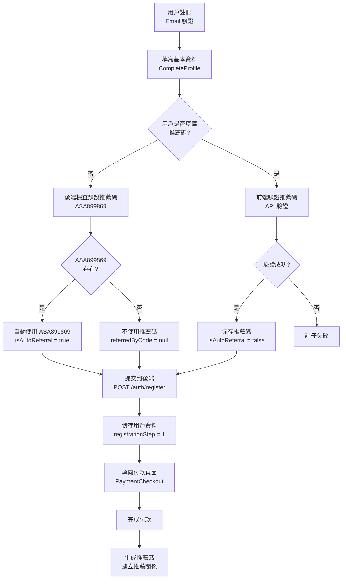

# 註冊流程深度分析（更新版）- 2025-01-20

## 🎯 核心答案

### **Q: 如果沒有填寫推薦碼，預設會代入什麼？**

### **A: 預設推薦碼是 `ASA899869`**

**關鍵配置位置：**
```typescript
// 文件：/supabase/functions/server/auth.ts 第 313 行
const DEFAULT_REFERRAL_CODE = 'ASA899869';
```

---

## 📋 完整註冊流程

### 流程圖



---

## 🔍 關鍵代碼分析

### 1️⃣ 前端：CompleteProfile.tsx

**推薦碼驗證邏輯（已移除 `DEFAULTRCM01`）：**

```typescript
// 第 403-459 行
const verifyReferralCode = async () => {
  if (!formData.referralCode.trim()) {
    setCodeError('請輸入推薦碼');
    return;
  }
  
  // ✅ 已移除 DEFAULTRCM01 的特殊處理
  // ❌ 不再有硬編碼的「系統預設」推薦碼
  
  setIsVerifyingCode(true);
  setCodeError('');

  try {
    // 所有推薦碼統一通過 API 驗證
    const result = await apiRequestJson(
      buildApiUrl('/listings/verify-referral-code'),
      {
        method: 'POST',
        body: JSON.stringify({
          referralCode: formData.referralCode.toLowerCase().trim(),
          currentUserId: null
        }),
      }
    );

    if (result.valid && result.referrerName) {
      setCodeVerified(true);
      setVerifiedReferralCode(formData.referralCode);
      setReferrerName(result.referrerName);
      showToast('推薦碼驗證成功', 'success');
    } else {
      setCodeError(result.error?.message || '推薦碼無效');
      showToast(result.error?.message || '推薦碼無效', 'error');
    }
  } catch (err: any) {
    // 錯誤處理...
  }
};
```

**關鍵變更：**
- ✅ **已移除** `DEFAULTRCM01` 的硬編碼邏輯
- ✅ 所有推薦碼統一通過 API 驗證
- ✅ 用戶無法繞過驗證

---

### 2️⃣ 後端：auth.ts - registerUser

**智能推薦碼處理邏輯：**

```typescript
// 第 309-356 行
// ✅ 4. 智能推薦碼處理（新規格）
let referredByUserId = null;
let referredByListingId = null;
let isAutoReferral = false;
const DEFAULT_REFERRAL_CODE = 'ASA899869';  // ✅ 預設推薦碼

let finalReferralCode = referralCode;

// 1️⃣ 如果用戶沒有填寫推薦碼，嘗試使用預設推薦碼
if (!referralCode || referralCode.trim() === '') {
  console.log(`用戶未填寫推薦碼，檢查預設推薦碼 ${DEFAULT_REFERRAL_CODE} 是否存在...`);
  
  const defaultReferralData = await kv.get(`referral_code:${DEFAULT_REFERRAL_CODE}`);
  
  if (defaultReferralData) {
    console.log(`✅ 預設推薦碼存在，自動使用: ${DEFAULT_REFERRAL_CODE}`);
    finalReferralCode = DEFAULT_REFERRAL_CODE;
    isAutoReferral = true;  // ✅ 標記為系統自動帶入
  } else {
    console.log(`⚠️ 預設推薦碼不存在，不建立推薦關係`);
    finalReferralCode = null;
  }
} else {
  console.log(`用戶主動填寫了推薦碼: ${referralCode}`);
  isAutoReferral = false;
}

// 2️⃣ 如果有推薦碼（用戶填寫或自動使用預設），進行驗證
if (finalReferralCode) {
  console.log(`驗證推薦碼: ${finalReferralCode} (${isAutoReferral ? '系統自動' : '用戶主動'})`);
  
  const referralData = await kv.get(`referral_code:${finalReferralCode}`);
  
  if (!referralData) {
    return c.json({ error: "推薦碼無效" }, 400);
  }
  
  referredByUserId = referralData.userId;
  referredByListingId = referralData.listingId;
  
  console.log(`✅ 推薦碼驗證成功: ${finalReferralCode}, 推薦人: ${referredByUserId}`);
}
```

**關鍵變更：**
- ✅ **已移除** `finalReferralCode !== 'DEFAULTRCM01'` 的特殊判斷
- ✅ 所有推薦碼統一驗證邏輯
- ✅ 預設推薦碼改為 `ASA899869`

---

### 3️⃣ 後端：listings.ts - createListing

**推薦關係讀取邏輯：**

```typescript
// 第 386-405 行
let referrerUserId = null;
let referrerListingId = null;

const referredByCode = userProfile.referredByCode;  // ✅ 從用戶 profile 讀取

if (referredByCode) {
  console.log(`✅ 用戶註冊時使用的推薦碼: ${referredByCode}`);
  
  const referralData = await kv.get(`referral_code:${referredByCode}`);
  if (referralData) {
    referrerUserId = referralData.userId;
    referrerListingId = referralData.listingId;
    console.log(`✅ 推薦人: ${referralData.userName} (${referrerUserId})`);
  } else {
    console.log(`⚠️ 推薦碼索引不存在: ${referredByCode}`);
  }
} else {
  console.log('ℹ 無推薦人');
}
```

**關鍵變更：**
- ✅ **已移除** `referredByCode !== 'DEFAULTRCM01'` 的特殊判斷
- ✅ 所有推薦碼統一處理邏輯

---

### 4️⃣ 後端：payment.ts - processPaymentCallback

**推薦關係建立邏輯：**

```typescript
// 第 377-420 行
if (referralCode) {
  console.log(`========== 🔗 開始處理推薦關係 ==========`);
  console.log(`被推薦人用戶ID: ${userId}`);
  console.log(`使用推薦碼: ${referralCode}`);
  
  const referralData = await kv.get(`referral_code:${referralCode}`);
  
  if (referralData) {
    const referrerUserId = referralData.userId;
    
    console.log(`✅ 找到推薦人用戶ID: ${referrerUserId}`);
    
    // ✅ 1. 記錄推薦來源
    await kv.set(`user:${userId}:referred_by`, {
      referrerUserId: referrerUserId,
      referrerListingId: referralData.listingId,
      referrerUserName: referralData.userName,
      referrerListingName: referralData.listingName,
      referredAt: createdAt,
      generation: 1
    });
    
    // ✅ 2. 立即更新推薦人的推薦樹（不需要等創建刊登）
    const referralTreeKey = `user:${referrerUserId}:referral_tree`;
    const referralTree = await kv.get(referralTreeKey) || {
      firstGeneration: [],
      secondGeneration: [],
      thirdGeneration: []
    };
    
    // 組裝被推薦人信息（此時還沒有刊登）
    const newMember = {
      userId: userId,
      userName: userProfile.name,
      userReferralCode: newReferralCode,  // 被推薦者的推薦碼
      listingId: null,          // 付款時還沒有刊登
      listingName: null,
      // ...
    };
  }
}
```

**關鍵變更：**
- ✅ **已移除** `referralCode !== 'DEFAULTRCM01'` 的特殊判斷
- ✅ 所有推薦碼統一建立推薦關係

---

## 📊 推薦碼決策表（更新版）

### 情況 A：用戶未填寫推薦碼

| KV Store 中的 `ASA899869` | 最終使用的推薦碼 | `isAutoReferral` | 推薦關係 | 付款確認頁顯示 |
|--------------------------|----------------|------------------|---------|--------------|
| ✅ **存在** | **`ASA899869`** | **`true`** | ✅ **建立** | ❌ **不顯示** |
| ❌ **不存在** | **`null`** | **`false`** | ❌ **不建立** | ❌ **不顯示** |

**檢查方式：**
```typescript
// 在 Supabase Edge Functions 中查詢
await kv.get('referral_code:ASA899869');

// 如果返回數據 → 會自動使用 ASA899869
// 如果返回 null → 不會自動使用
```

---

### 情況 B：用戶填寫推薦碼

| 用戶輸入 | API 驗證結果 | 最終使用的推薦碼 | `isAutoReferral` | 推薦關係 | 付款確認頁顯示 |
|---------|-------------|----------------|------------------|---------|--------------|
| **`abc123456`** | ✅ **有效** | **`abc123456`** | **`false`** | ✅ **建立** | ✅ **顯示** |
| **`abc123456`** | ❌ **無效** | 註冊失敗 | - | ❌ **不建立** | - |
| **`ASA899869`** | ✅ **有效** | **`ASA899869`** | **`false`** | ✅ **建立** | ✅ **顯示** |

**前端驗證流程：**
```typescript
// 用戶填寫推薦碼後，點擊「驗證」按鈕
verifyReferralCode();

// 1. 呼叫 API：POST /listings/verify-referral-code
// 2. 如果驗證成功：顯示推薦人姓名
// 3. 如果驗證失敗：顯示錯誤訊息，無法繼續註冊
```

---

## 💾 資料結構追蹤

### 用戶未填寫推薦碼 + `ASA899869` 存在

#### **Step 1: 填寫基本資料**

**前端提交：**
```json
{
  "name": "張三",
  "nationalId": "A123456789",
  "phone": "0912345678",
  "birthDate": "1990-01-01",
  "referralCode": ""  // ⚠️ 空字串
}
```

**後端處理：**
```typescript
// auth.ts 第 319-328 行
if (!referralCode || referralCode.trim() === '') {
  const defaultReferralData = await kv.get('referral_code:ASA899869');
  
  if (defaultReferralData) {
    finalReferralCode = 'ASA899869';
    isAutoReferral = true;
  }
}
```

**儲存到 KV Store：`user:${userId}:profile`**
```json
{
  "id": "uuid-xxx",
  "email": "user@example.com",
  "name": "張三",
  "nationalId": "A123456789",
  "phone": "0912345678",
  "birthDate": "1990-01-01",
  "registrationStep": 1,  // ✅ 等待付款
  "referralCode": null,   // ✅ 付款後才生成
  "referredByCode": "ASA899869",      // ✅ 自動帶入的預設推薦碼
  "referredByUserId": "推薦人的userId",
  "referredByListingId": "推薦人的listingId",
  "isAutoReferral": true,  // ✅ 標記為自動推薦
  "createdAt": "2024-12-15T12:34:56.789Z",
  "updatedAt": "2024-12-15T12:34:56.789Z"
}
```

---

#### **Step 2: 付款確認頁（PaymentCheckout）**

**顯示邏輯：**
```typescript
// PaymentCheckout.tsx
{pendingUser.referredByCode && !pendingUser.isAutoReferral && (
  <>
    <p>推薦碼：{pendingUser.referredByCode}</p>
    <p>推薦人：{referrerInfo.name}</p>
  </>
)}
```

**顯示結果：**
```
付款確認頁面：
  姓名：張三
  生日：1990-01-01
  身分證字號：A123456789
  手機：0912345678
  Email：user@example.com
  （推薦碼和推薦人不顯示）✅
```

**⚠️ 關鍵邏輯：**
- `referredByCode = 'ASA899869'` → ✅ 有值
- `isAutoReferral = true` → ✅ 是自動推薦
- 條件：`!pendingUser.isAutoReferral` → ❌ 不滿足
- **結果：不顯示推薦碼和推薦人**

---

#### **Step 3: 完成付款**

**推薦關係建立：**
```typescript
// payment.ts 第 377 行
if (referralCode) {  // ✅ referralCode = 'ASA899869'
  const referralData = await kv.get('referral_code:ASA899869');
  
  if (referralData) {
    // ✅ 建立推薦關係
    // ✅ 更新推薦人的推薦樹
    // ✅ 發放首月獎勵（如果推薦人有刊登）
  }
}
```

**結果：**
- ✅ 推薦關係**已建立**
- ✅ `ASA899869` 的持有者成為推薦人
- ✅ 推薦人會獲得推薦獎勵

---

### 用戶填寫推薦碼 `abc123456`

#### **Step 1: 填寫基本資料**

**前端驗證：**
```typescript
// 用戶輸入 'abc123456' 並點擊「驗證」
verifyReferralCode();

// API 驗證成功，顯示推薦人姓名
setCodeVerified(true);
setReferrerName('李四');
```

**前端提交：**
```json
{
  "name": "張三",
  "nationalId": "A123456789",
  "phone": "0912345678",
  "birthDate": "1990-01-01",
  "referralCode": "abc123456"  // ✅ 用戶主動填寫
}
```

**後端處理：**
```typescript
// auth.ts 第 334-335 行
else {
  console.log(`用戶主動填寫了推薦碼: ${referralCode}`);
  isAutoReferral = false;
}
```

**儲存到 KV Store：`user:${userId}:profile`**
```json
{
  "id": "uuid-xxx",
  "email": "user@example.com",
  "name": "張三",
  "nationalId": "A123456789",
  "phone": "0912345678",
  "birthDate": "1990-01-01",
  "registrationStep": 1,
  "referralCode": null,
  "referredByCode": "abc123456",  // ✅ 用戶主動填寫的推薦碼
  "referredByUserId": "推薦人的userId",
  "referredByListingId": "推薦人的listingId",
  "isAutoReferral": false,  // ✅ 標記為用戶主動填寫
  "createdAt": "2024-12-15T12:34:56.789Z",
  "updatedAt": "2024-12-15T12:34:56.789Z"
}
```

---

#### **Step 2: 付款確認頁（PaymentCheckout）**

**顯示邏輯：**
```typescript
{pendingUser.referredByCode && !pendingUser.isAutoReferral && (
  <>
    <p>推薦碼：{pendingUser.referredByCode}</p>
    <p>推薦人：{referrerInfo.name}</p>
  </>
)}
```

**顯示結果：**
```
付款確認頁面：
  姓名：張三
  生日：1990-01-01
  身分證字號：A123456789
  手機：0912345678
  Email：user@example.com
  推薦碼：abc123456  ✅
  推薦人：李四  ✅
```

**⚠️ 關鍵邏輯：**
- `referredByCode = 'abc123456'` → ✅ 有值
- `isAutoReferral = false` → ✅ 不是自動推薦
- 條件：`!pendingUser.isAutoReferral` → ✅ 滿足
- **結果：顯示推薦碼和推薦人**

---

## 🔄 核心邏輯對比

### 與舊版本的差異

| 項目 | 舊版本 | 新版本（更新後） |
|------|--------|----------------|
| **前端特殊推薦碼** | `DEFAULTRCM01`（硬編碼） | ❌ **已移除** |
| **後端預設推薦碼** | `dud948785` | `ASA899869` ✅ |
| **特殊判斷** | `!== 'DEFAULTRCM01'`（多處） | ❌ **已移除** |
| **驗證邏輯** | 前端可繞過 | ✅ **統一走 API** |
| **推薦關係建立** | 排除 `DEFAULTRCM01` | ✅ **統一處理** |

---

## ✅ 改進總結

### 1️⃣ 前端改進

**CompleteProfile.tsx：**
- ✅ **移除** `DEFAULTRCM01` 硬編碼邏輯
- ✅ 所有推薦碼統一通過 API 驗證
- ✅ 無法繞過驗證流程

---

### 2️⃣ 後端改進

**auth.ts：**
- ✅ 預設推薦碼統一為 `ASA899869`
- ✅ **移除** `!== 'DEFAULTRCM01'` 特殊判斷
- ✅ 所有推薦碼統一驗證邏輯

**listings.ts：**
- ✅ **移除** `!== 'DEFAULTRCM01'` 特殊判斷
- ✅ 所有推薦碼統一處理

**payment.ts：**
- ✅ **移除** `!== 'DEFAULTRCM01'` 特殊判斷
- ✅ 所有推薦碼統一建立推薦關係

---

### 3️⃣ 推薦計畫加入流程

**JoinReferralProgramDialog.tsx：**
- ✅ 用戶完成付款後，可加入推薦計畫
- ✅ 需要簽署推薦計畫條款
- ✅ 簽署後生成推薦碼

---

## 📝 常見問題（FAQ）

### Q1: 如何設定預設推薦碼？

**A:** 需要在 KV Store 中創建 `referral_code:ASA899869` 記錄。

**設定方式：**
1. 推薦人（持有 `ASA899869`）完成註冊並付款
2. 系統自動生成推薦碼 `ASA899869`
3. 推薦碼自動存入 KV Store：`referral_code:ASA899869`

**驗證方式：**
```typescript
// 在 Supabase Edge Functions 中查詢
const data = await kv.get('referral_code:ASA899869');

if (data) {
  console.log('預設推薦碼已設定:', data);
} else {
  console.log('預設推薦碼不存在');
}
```

---

### Q2: 用戶可以主動輸入 `ASA899869` 嗎？

**A:** 可以。

**情況分析：**
- 用戶主動輸入 `ASA899869` → 前端驗證 → API 驗證成功
- `isAutoReferral = false`（標記為用戶主動填寫）
- 付款確認頁**會顯示**推薦碼和推薦人

**與自動帶入的差異：**

| 情況 | `referredByCode` | `isAutoReferral` | 付款確認頁顯示 |
|------|-----------------|------------------|--------------|
| 系統自動帶入 | `'ASA899869'` | `true` | ❌ 不顯示 |
| 用戶主動輸入 | `'ASA899869'` | `false` | ✅ 顯示 |

---

### Q3: 如果 `ASA899869` 不存在會怎樣？

**A:** 用戶註冊成功，但**沒有推薦人**。

**流程：**
1. 用戶未填寫推薦碼
2. 後端檢查 `referral_code:ASA899869` → 不存在
3. `finalReferralCode = null`
4. 用戶資料中：`referredByCode: null`、`referredByUserId: null`
5. 付款後**不建立推薦關係**
6. 用戶成功註冊，獲得自己的推薦碼

---

### Q4: 推薦碼格式是什麼？

**A:** 推薦碼格式為「3個大寫英文字母 + 6個數字」。

**格式規範：**
```typescript
// 格式：ABC123456
// 正則表達式：^[A-Z]{3}\d{6}$

// 有效範例：
'ASA899869' ✅
'ABC123456' ✅
'XYZ999999' ✅

// 無效範例：
'asa899869' ❌（小寫）
'AB123456' ❌（只有2個字母）
'ABCD123456' ❌（4個字母）
'ABC12345' ❌（5個數字）
```

**生成邏輯：**
```typescript
// payment.ts - 生成推薦碼
function generateReferralCode() {
  const letters = 'ABCDEFGHIJKLMNOPQRSTUVWXYZ';
  let code = '';
  
  // 3個隨機大寫字母
  for (let i = 0; i < 3; i++) {
    code += letters.charAt(Math.floor(Math.random() * letters.length));
  }
  
  // 6個隨機數字
  for (let i = 0; i < 6; i++) {
    code += Math.floor(Math.random() * 10).toString();
  }
  
  return code;
}
```

---

### Q5: 付款確認頁為什麼不顯示自動推薦碼？

**A:** 為了避免用戶困惑。

**設計理念：**
1. 用戶未主動填寫推薦碼 → 系統自動幫用戶建立推薦關係
2. 但用戶可能不知道 `ASA899869` 是誰
3. 如果顯示「推薦碼：ASA899869」，用戶可能會疑惑「我沒填過這個啊？」
4. 因此選擇不顯示，讓流程更流暢

**如果需要顯示：**
```typescript
// 修改 PaymentCheckout.tsx
{pendingUser.referredByCode && (
  <>
    {pendingUser.isAutoReferral ? (
      <p className="text-muted-foreground">推薦人：系統預設推薦人</p>
    ) : (
      <>
        <p>推薦碼：{pendingUser.referredByCode}</p>
        <p>推薦人：{referrerInfo.name}</p>
      </>
    )}
  </>
)}
```

---

## 🎯 最終總結

### 核心答案

**Q: 如果沒有填寫推薦碼，預設會代入什麼？**

**A: 預設推薦碼是 `ASA899869`**

### 前提條件

**推薦碼生效的前提：**
1. ✅ KV Store 中必須存在 `referral_code:ASA899869`
2. ✅ 該推薦碼必須有效（綁定到某個用戶）

### 兩種情況

#### **情況 A：`ASA899869` 存在**
```
用戶未填推薦碼
  ↓
後端檢查 referral_code:ASA899869
  ↓
✅ 存在 → 自動使用 ASA899869
  ↓
isAutoReferral = true
  ↓
付款確認頁不顯示推薦碼
  ↓
✅ 建立推薦關係（ASA899869 的持有者成為推薦人）
```

#### **情況 B：`ASA899869` 不存在**
```
用戶未填推薦碼
  ↓
後端檢查 referral_code:ASA899869
  ↓
❌ 不存在 → 不使用推薦碼
  ↓
referredByCode = null
  ↓
付款確認頁不顯示推薦碼
  ↓
❌ 不建立推薦關係
```

---

## 📄 相關文件位置

| 功能 | 文件路徑 | 關鍵行數 | 關鍵變更 |
|------|---------|---------|---------|
| 前端註冊表單 | `/components/CompleteProfile.tsx` | 403-459 | ✅ 移除 `DEFAULTRCM01` |
| 前端付款確認 | `/components/PaymentCheckout.tsx` | 580-595 | - |
| 前端推薦計畫 | `/components/referral/JoinReferralProgramDialog.tsx` | 全文 | ✅ 新增 |
| 後端註冊邏輯 | `/supabase/functions/server/auth.ts` | 309-368 | ✅ 預設碼改為 `ASA899869` |
| 後端創建刊登 | `/supabase/functions/server/listings.ts` | 386-425 | ✅ 移除特殊判斷 |
| 後端付款回調 | `/supabase/functions/server/payment.ts` | 377-420 | ✅ 移除特殊判斷 |

---

**文檔版本：** 2.0  
**最後更新：** 2025-01-20  
**適用系統版本：** Uknow v2.1  
**核心改進：** 統一推薦碼處理邏輯，移除 `DEFAULTRCM01` 特殊處理
